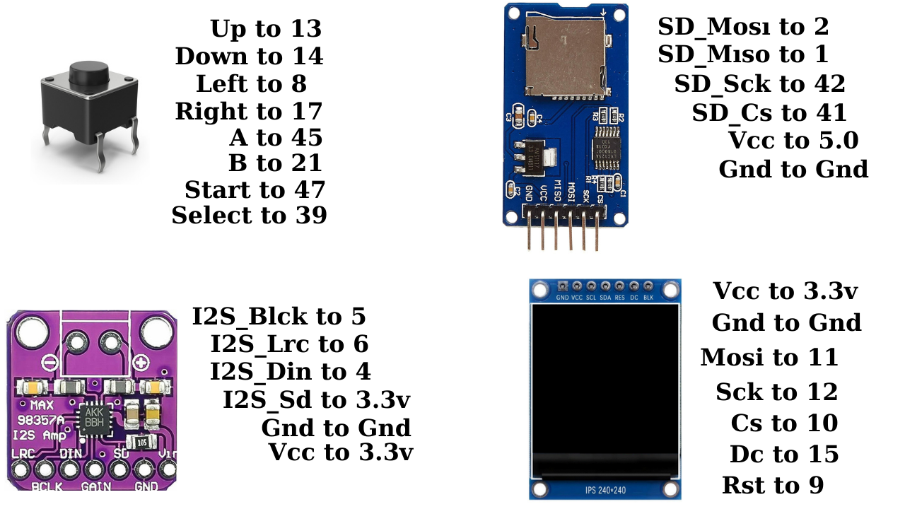

# Creating a retro-Nintendo Emulation System using ESP-32 WROOM DA Module

A high-performance, DIY handheld NES (Nintendo Entertainment System) emulator powered by the ESP32 microcontroller. This project features high-quality audio via I2S, smooth rendering on an ST7789 display, and games loaded directly from an SD card.

## 📺 Video Tutorial

Build your own following the step-by-step guide! https://youtu.be/wruJ-BESnX8

[](https://www.youtube.com/watch?v=wruJ-BESnX8)

> **Click the image above to watch the full tutorial on YouTube.**

## ✨ Features

* **Full Speed Emulation:** Runs NES games smoothly thanks to the ESP32's dual-core power.
* **High-Quality Audio:** Crystal clear game sounds using the MAX98357A I2S amplifier.
* **Storage:** Load hundreds of ROMs from a Micro SD Card.
* **Display:** Vibrant colors using the ST7789 IPS TFT display.
* **Controls:** Full 8-button support (D-Pad + A/B + Start/Select).

## 🛠️ Hardware Requirements

To build this project, you will need the following components:

* **Microcontroller:** ESP32 (DevKit (V1) or bare module)
* **Display:** ST7789 SPI TFT Module (e.g., 1.69")
* **Audio:** MAX98357A I2S Amplifier Module + 3W 4Ω Speaker
* **Storage:** Micro SD Card Reader Module + Micro SD Card (formatted FAT32)
* **Controls:** 8x Tactile Push Buttons (6x6mm)
* **Power:** LiPo Battery & Charging Circuit (Optional/TP4056)
* **Wires & Perfboard:** For connections.

## 🔌 Wiring & Pinout

Below is the connection diagram for the components. 

> **⚠️ NOTE:** Please verify these pin assignments in `hw_config.h` (or your main definition file) before flashing.

### 1. ST7789 Display (SPI)
| Display Pin | ESP32-S3 GPIO | Function |
| :--- | :--- | :--- |
| VCC | 3.3V | Power |
| GND | GND | Ground |
| SCL (SCLK) | GPIO **[12]** | SPI Clock |
| SDA (MOSI) | GPIO **[11]** | SPI MOSI |
| RES (RST) | GPIO **[9]** | Reset |
| DC | GPIO **[15]** | Data/Command |

### 2. Micro SD Card Module (SPI)
| SD Module Pin | ESP32-S3 GPIO | Function |
| :--- | :--- | :--- |
| CS | GPIO **[41]** | Chip Select |
| MOSI | GPIO **[2]** | Shared with Display |
| CLK | GPIO **[42]** | Shared with Display |
| MISO | GPIO **[1]** | SPI MISO |
| VCC | 3.3V | Power |
| GND | GND | Ground |

### 3. MAX98357A Audio (I2S)
| Amp Pin | ESP32-S3 GPIO | Function |
| :--- | :--- | :--- |
| LRC | GPIO **[6]** | Left/Right Clock |
| BCLK | GPIO **[5]** | Bit Clock |
| DIN | GPIO **[4]** | Data In |
| VCC | 5V / 3.3V | Power |
| GND | GND | Ground |

### 4. Controller Buttons
| Button | ESP32-S3 GPIO |
| :--- | :--- |
| UP | GPIO **[13]** |
| DOWN | GPIO **[14]** |
| LEFT | GPIO **[8]** |
| RIGHT | GPIO **[17]** |
| A | GPIO **[45]** |
| B | GPIO **[21]** |
| START | GPIO **[47]** |
| SELECT | GPIO **[39]** |

*(Connect the other side of all buttons to GND)*



## 💾 SD Card Setup

1.  Format your Micro SD card to **FAT32**.
2.  Copy your `.nes` game files into root folder.
3.  Insert the SD card into the module.

## 🚀 Installation & Setup

1.  **Clone the Repository:**
    ```bash
    git clone [https://github.com/mashaalzulfikar/Creating-a-retro-Nintendo-Emulation-System-using-ESP-32-WROOM-DA-Module.git](https://github.com/mashaalzulfikar/Creating-a-retro-Nintendo-Emulation-System-using-ESP-32-WROOM-DA-Module.git)
    ```
2.  **Open in IDE:**
    * Open the project using **Arduino IDE**.
3.  **Install Libraries:**
    * Ensure you have installed the necessary libraries (e.g., `Audio`, etc.) `library.properties`.
4.  **Configure:**
    * Check the pin definitions in the code to match your wiring.
5.  **Flash:**
    * Connect your ESP32-S3 via USB.
    * Select the correct Board and Port.
    * Upload the code.

## 🎮 Controls

| Button | Action |
| :--- | :--- |
| **D-Pad** | Navigate Menu / Move Character |
| **A** | Confirm / Jump |
| **B** | Back / Attack |
| **Start** | Pause Game |
| **Select** | Game Mode / Menu |

---

## 🤝 Acknowledgement

Shout-out to Dsn Industries, who uploaded the project tutorial and guide on YouTube and GitHub:

* **YouTube:** [https://www.youtube.com/@DsnIndustries/videos]
* **GitHub:** [https://github.com/derdacavga/Esp32-S3-nes-emulator-by-DSN]
